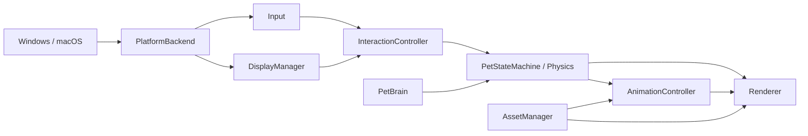
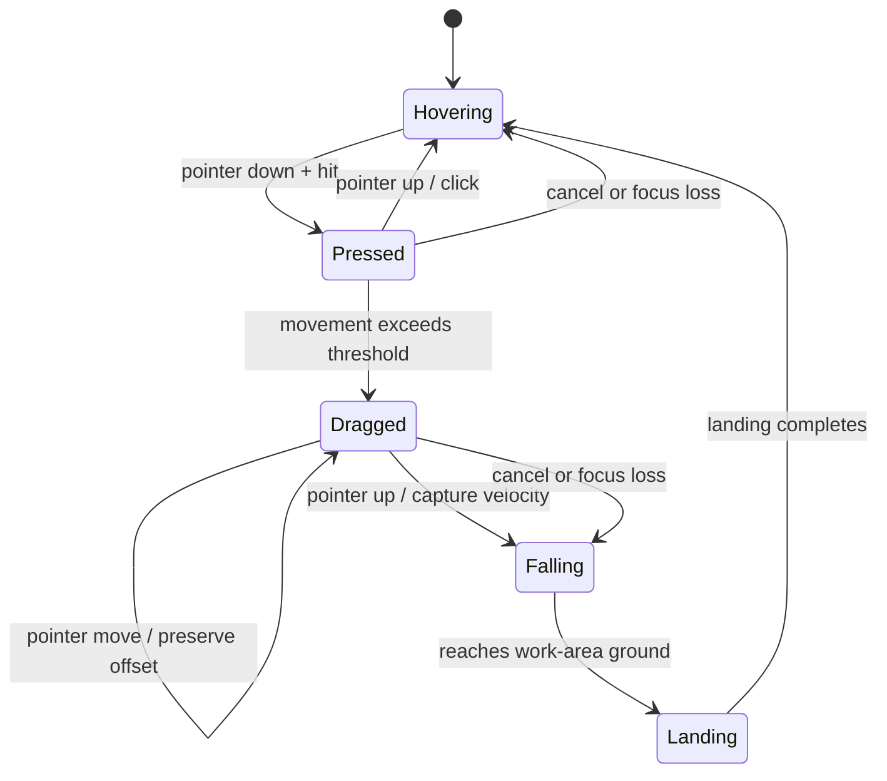

# DesktopPet 架构契约

本文定义 DesktopPet MVP 的可编码边界。产品范围和路线图见 [DEVELOPMENT_PLAN.md](DEVELOPMENT_PLAN.md)，阶段顺序、验证命令和验收证据见 [TASKS.md](TASKS.md)。实现与本文冲突时，应先更新并评审本文，而不是在业务代码中引入隐含例外。

## 1. 架构目标

- 以 macOS 作为 MVP 运行时参考实现和人工验收平台；Windows 保持编译和自动测试兼容，系统 API 差异只留在平台层。
- 使行为、状态机、物理、边界和坐标转换可在无窗口、无 GPU 环境中确定性测试。
- 让窗口事件循环保持响应，不在主线程等待网络、磁盘批处理或其他不可控任务。
- 只在状态可见变化时更新和渲染，满足常驻应用的 CPU 与内存预算。
- 将外部 GLB、纹理和 manifest 当作不可信数据处理。
- CI 始终覆盖 macOS / Windows；视觉、交互和性能的人工验收只在 macOS 进行，缺少实机证据时不推断 Windows 运行时行为。

## 2. Workspace 与目录

MVP 初始采用一个 Cargo workspace 和一个应用 crate。模块先在 crate 内通过 `pub(crate)` 边界隔离；只有出现独立发布、独立版本或显著编译隔离需求时才允许拆成多个 crate。不得为了“未来可能复用”提前拆分。

```text
desktop-pet/
├── Cargo.toml                 # [workspace]，初始只有 app 成员
├── Cargo.lock
├── crates/
│   └── desktop-pet/
│       ├── Cargo.toml
│       └── src/
│           ├── main.rs
│           ├── app.rs
│           ├── config.rs
│           ├── error.rs
│           ├── time.rs
│           ├── asset/
│           ├── animation/
│           ├── display/
│           ├── input/
│           ├── interaction/
│           ├── pet/
│           ├── platform/
│           │   ├── mod.rs
│           │   ├── windows/
│           │   └── macos/
│           └── render/
├── assets/
│   ├── LICENSES/
│   └── pets/default/
├── shaders/
├── tests/fixtures/
└── evidence/                  # 人工验收截图与日志；是否入库由 Phase 0 决定
```

根 manifest 使用 resolver 2。依赖版本在 Phase 0 选择，由 `Cargo.lock` 固定；架构文档不写具体版本。

## 3. 模块边界与依赖方向

运行时事件和数据遵循 `Platform -> Input/Display -> Pet/Interaction -> Animation/Renderer`，具体按以下方向流动：



图中的箭头表示运行时数据流，不表示允许任意 Rust `use`。编译期依赖遵守以下规则：

- 公共值类型和窄接口放在其所有者模块或小型 `types` 子模块中，不能放入“大而全”的全局工具模块。
- `pet` 和 `interaction` 不得导入 `platform` 或 `render`。
- `PetBrain` 不得导入平台、输入、资源、动画或渲染实现；它只接收抽象观察值并输出 `PetIntent`。
- `animation` 不得操作窗口；`render` 不得决定行为状态。
- `platform` 不得知道 `PetState`、动画名称或模型结构。
- 目标平台条件编译只允许出现在 `platform/mod.rs`、`platform/windows/**`、`platform/macos/**` 和 Cargo target-specific dependencies 中。
- `app` 是组合根，可以持有并协调所有模块；其他模块不得通过全局单例互相访问。

## 4. 所有权模型

`DesktopPetApp` 在主线程拥有全部长期状态：

```text
DesktopPetApp
├── window / event-loop state
├── Box<dyn PlatformBackend>
├── DisplayManager
├── InputState
├── InteractionController
├── Pet
│   ├── PetBrain
│   ├── PetStateMachine
│   └── PhysicsBody
├── AnimationController
├── AssetManager
├── Renderer
└── FrameScheduler / Clock
```

所有模块默认单线程所有权，不使用可变全局状态。GPU handle 只由 `Renderer` 拥有；CPU 资源由 `AssetManager` 缓存，并以不可变 handle 或显式上传对象交给动画和渲染层。每一逻辑步结束时，`app` 生成不可变的 `RenderSnapshot`，渲染器只消费快照。

未来的后台任务只能通过有界 channel 返回纯数据或结果，不能持有窗口、surface、状态机或 GPU mutable reference。

## 5. 主线程、更新与帧调度

窗口创建、平台窗口 API、winit event loop、应用状态更新和 surface 渲染都在主线程运行。MVP 不引入 Tokio runtime。

逻辑采用固定时间步，渲染采用按需调度：

- 固定逻辑步长：`1 / 60 s`。
- 每次事件循环用 monotonic clock 累加真实时间，单次累计最多 `250 ms`。
- 一轮最多执行 5 个逻辑步，超过部分丢弃并记录节流警告，避免唤醒或断点后 spiral of death。
- 物理、Brain、状态机和动画都只接收固定 `dt`；测试可注入模拟时钟。
- `FrameScheduler` 根据状态选择 Active 60、Idle 30、Sleep 15 FPS；完全静止且无 deadline 时使用事件驱动模式。
- 输入、resize、scale factor、surface 恢复、状态变化或动画推进会设置 `dirty`。
- 到达下一帧 deadline 且 `dirty` 时调用 `request_redraw`；只在 redraw 回调中 acquire surface 并渲染。
- 下一次唤醒时间取动画帧、Brain 决策、物理步和显式 timer 中最早者，winit 使用等待或 `WaitUntil`，禁止 busy loop。

```mermaid
sequenceDiagram
    participant OS
    participant Loop as winit event loop
    participant App
    participant Logic as Brain / Interaction / Physics / Animation
    participant GPU as Renderer

    OS->>Loop: window, pointer, monitor or timer event
    Loop->>App: normalized event
    App->>Logic: zero or more fixed updates
    Logic-->>App: state, pose and dirty flag
    App->>App: FrameScheduler computes next deadline
    App->>Loop: request_redraw when due
    Loop->>GPU: RedrawRequested(RenderSnapshot)
    GPU-->>Loop: present or recoverable surface result
    Loop->>Loop: Wait / WaitUntil(next deadline)
```

任何资源加载如果会明显阻塞事件循环，必须在进入正常窗口交互前完成，或改为后台读取与主线程 GPU 上传两阶段；渲染器永远不等待网络。

## 6. 核心值类型

以下是语义契约，字段可在实现时增加，但不得混淆单位或所有权。

```rust
/// 虚拟桌面左上角为参考系的逻辑像素；允许负值。
#[derive(Clone, Copy, Debug, PartialEq)]
pub struct DesktopPosition {
    pub x: f64,
    pub y: f64,
}

#[derive(Clone, Copy, Debug, PartialEq)]
pub struct LogicalSize {
    pub width: f64,
    pub height: f64,
}

#[derive(Clone, Copy, Debug, PartialEq, Eq)]
pub struct PhysicalSize {
    pub width: u32,
    pub height: u32,
}

#[derive(Clone, Debug, PartialEq)]
pub struct MonitorInfo {
    pub id: MonitorId,
    pub work_area_origin: DesktopPosition,
    pub work_area_size: LogicalSize,
    pub scale_factor: f64,
    pub is_primary: bool,
}

#[derive(Clone, Copy, Debug, Default)]
pub struct MouseState {
    pub desktop_position: Option<DesktopPosition>,
    pub window_logical_position: Option<[f64; 2]>,
    pub left_pressed: bool,
    pub modifiers: Modifiers,
}

#[derive(Clone, Copy, Debug)]
pub struct PhysicsBody {
    pub position: DesktopPosition,
    pub velocity_logical_px_per_s: [f64; 2],
    pub gravity_logical_px_per_s2: f64,
    pub grounded: bool,
}

#[derive(Clone, Copy, Debug, PartialEq, Eq)]
pub enum PetState {
    Idle,
    Walking,
    Turning,
    Interacting,
    Dragged,
    Falling,
    Landing,
    Sleeping,
}

#[derive(Clone, Copy, Debug, PartialEq)]
pub enum PetIntent {
    StayIdle,
    Walk { direction: HorizontalDirection },
    Turn { direction: HorizontalDirection },
    LookAt { desktop_target: DesktopPosition },
    Interact,
}
```

约束：

- 桌面位置和速度均使用逻辑像素，原点由平台层统一为虚拟桌面左上角；禁止业务层使用 macOS 原生的左下角坐标。
- GPU viewport、纹理和 surface 使用物理像素。
- 比较浮点坐标时使用明确 epsilon；窗口落点在调用系统 API 前由 `DisplayManager` 做一致的舍入。
- `PhysicsBody.position` 是窗口桌面位置的唯一真相来源；模型局部/world transform 不反向更新它。
- `PetStateMachine` 拥有当前 `PetState` 和转换计时；`PetBrain` 只产生意图，不拥有状态。
- 拖动是高优先级状态；处于 `Dragged` 时，普通 Brain 意图被忽略。

## 7. 平台契约

`PlatformBackend` 是系统窗口能力的唯一入口。接口必须返回上下文明确的错误，不能 panic。

```rust
pub trait PlatformBackend {
    fn set_always_on_top(&mut self, enabled: bool) -> Result<(), PlatformError>;
    fn set_click_through(&mut self, enabled: bool) -> Result<(), PlatformError>;
    fn cursor_position(&self) -> Result<Option<DesktopPosition>, PlatformError>;
    fn window_position(&self) -> Result<DesktopPosition, PlatformError>;
    fn set_window_position(&mut self, position: DesktopPosition) -> Result<(), PlatformError>;
    fn monitors(&self) -> Result<Vec<MonitorInfo>, PlatformError>;
}
```

平台实现还负责把系统事件转换为 app 可消费的统一事件。`set_click_through(true)` 表示窗口当前不接收鼠标；状态切换必须幂等并缓存上次值，避免每帧重复调用系统 API。

### 7.1 Windows

- 所有 windows-rs、`HWND`、窗口 style 和消息处理代码位于 `platform/windows/**`。
- 透明区域优先通过 `WM_NCHITTEST` 返回 `HTTRANSPARENT`，宠物区域返回 `HTCLIENT`。
- 置顶与透明合成使用当前依赖版本对应的受支持 API；扩展 style 变更后检查返回值和 last error。
- 将虚拟桌面与 per-monitor DPI 信息归一化为本文件定义的逻辑坐标。

### 7.2 macOS

- 所有 objc2 / AppKit 类型和 unsafe Objective-C 调用位于 `platform/macos/**`。
- `NSWindow` 必须非 opaque、背景透明、无阴影并处于约定的浮动层级。
- 透明区域通过动态切换 `ignoresMouseEvents` 实现。窗口忽略事件期间仍通过全局光标位置和定时/系统唤醒重新命中，进入宠物区域前恢复事件接收。
- 将 AppKit 屏幕坐标归一化为虚拟桌面左上角逻辑坐标。

每个 unsafe block 前必须写明不变量，例如对象生命周期、线程要求和指针有效性。业务模块不得出现 `HWND`、`NSWindow` 或相关条件编译。

## 8. DisplayManager 与坐标流

`DisplayManager` 拥有最后一份有效显示器快照、活动显示器选择和全部坐标转换。显示器改变、窗口跨屏或 DPI 改变时，以一个原子快照更新转换参数并触发 resize。

```rust
pub trait DisplayConversions {
    fn desktop_to_window_logical(
        &self,
        desktop: DesktopPosition,
        window_origin: DesktopPosition,
    ) -> [f64; 2];

    fn logical_to_physical(&self, logical: [f64; 2], scale_factor: f64) -> [f64; 2];
    fn physical_to_ndc(&self, physical: [f64; 2], viewport: PhysicalSize) -> [f32; 2];
    fn clamp_to_work_area(&self, position: DesktopPosition, window: LogicalSize) -> DesktopPosition;
}
```

指针射线的唯一合法转换链为：

```text
桌面逻辑坐标
  -> 减去窗口桌面原点
窗口局部逻辑坐标
  -> 乘活动 scale factor
窗口局部物理像素
  -> x = 2x/w - 1, y = 1 - 2y/h
NDC
  -> inverse(projection * view)
相机世界射线
```

宽或高为 0、光标不在窗口、矩阵不可逆时转换返回 `None`，不得生成 NaN。基础 2D 命中在窗口局部逻辑坐标完成；只有未来精确 3D 命中才继续转换为射线。

工作区而不是显示器完整尺寸决定地面和边缘，避免覆盖任务栏或 Dock。显示器重叠、空列表和窗口跨两屏时使用以下规则：优先窗口中心所在显示器，其次最大相交面积，最后 primary monitor；无法获得显示器时保留最后有效快照并记录 warning。

## 9. AssetManager 与资源 manifest

`AssetManager` 负责读取、校验和缓存 manifest、GLB、纹理及动画 clip。它输出 CPU 侧 `PetAsset`，不创建 GPU buffer，不决定当前播放动画。

```rust
pub trait AssetManager {
    fn load_pet(&mut self, manifest_path: &Path) -> Result<PetAssetHandle, AssetError>;
    fn pet(&self, handle: PetAssetHandle) -> Option<&PetAsset>;
}
```

最小 manifest：

```json
{
  "format_version": 1,
  "id": "quaternius_default",
  "name": "Default Pet",
  "model": "pet.glb",
  "animations": {
    "idle": "Idle",
    "walk": "Walk"
  },
  "skeleton": {
    "head_joint": "Head"
  },
  "source": {
    "author": "Quaternius",
    "url": "<original-download-url>",
    "license": "CC0-1.0",
    "retrieved_on": "YYYY-MM-DD",
    "sha256": "<asset-sha256>"
  }
}
```

规则：

- `format_version`、`id`、`model`、Idle 和 Walk 映射为必填；未知必填版本直接报错。
- 所有路径相对 manifest 目录解析并 canonicalize，结果必须仍在该宠物资源根目录内。
- MVP 只接受仓库内预置的 JSON、GLB、PNG、JPG/JPEG；不执行脚本、不加载动态库、不访问 URL。
- 限制单文件大小、纹理尺寸、节点、joint、primitive 和动画时长；具体上限放入经过评审的配置常量并覆盖边界测试。
- 缺少 head joint 只禁用 Look At Mouse 并产生一次 warning；缺少 Idle / Walk、模型损坏或许可证元数据缺失是默认资产的阻断错误。
- 默认开发资产固定为 Quaternius Animated Animals 中满足要求的 CC0 GLB；许可证副本保存在 `assets/LICENSES/`，实际 clip 名称只由 manifest 映射。

## 10. Renderer 契约

`Renderer` 拥有 wgpu instance、adapter、device、queue、surface、pipeline、GPU buffers 和上传后的资源。它不读文件、不查询鼠标、不更新状态机。

```rust
pub trait Renderer {
    fn upload_pet(&mut self, asset: &PetAsset) -> Result<RenderPetHandle, RenderError>;
    fn resize(&mut self, physical_size: PhysicalSize, scale_factor: f64);
    fn render(&mut self, snapshot: &RenderSnapshot) -> Result<(), RenderError>;
}

pub struct RenderSnapshot {
    pub pet: RenderPetHandle,
    pub model_transform: glam::Mat4,
    pub joint_matrices: Vec<glam::Mat4>,
    pub camera: CameraSnapshot,
    pub viewport: PhysicalSize,
}
```

渲染约束：

- surface 选择系统支持的透明 alpha mode，clear color 固定为 `(0, 0, 0, 0)`。
- 材质透明遵循 glTF alpha mode；混合状态必须避免把背景写成不透明黑色。
- resize 到零尺寸时暂停 acquire / present，恢复非零尺寸后重配 surface。
- wgpu 30 的 `CurrentSurfaceTexture::Lost` 触发 surface 重建，`Outdated` 触发重配，`Suboptimal` 在 present 后重配，`Timeout` / `Occluded` 跳过当前帧，`Validation` 是致命错误；device uncaptured-error 回调中的 out of memory 同样是致命错误。
- joint matrix 上限和 uniform/storage 布局由 adapter limit 校验，超限资源在上传前拒绝。
- 至少保留无窗口 adapter smoke test 和离屏像素断言；透明桌面合成仍需实机验收。

## 11. PetBrain 与状态机

`PetBrain` 是纯决策器。它接收只读观察值、固定 `dt`、可注入随机源和单调时钟，输出零或一个 `PetIntent`。

```rust
pub trait PetBrain {
    fn update(
        &mut self,
        observation: &PetObservation,
        now: Duration,
        rng: &mut dyn RandomSource,
    ) -> Option<PetIntent>;
}

pub trait PetStateMachine {
    fn state(&self) -> PetState;
    fn apply(&mut self, intent: PetIntent, context: &TransitionContext) -> StateTransition;
    fn fixed_update(&mut self, dt: Duration, context: &TransitionContext) -> StateTransition;
}
```

状态机检查意图是否合法并产生 `StateTransition`，其中包含下一状态、速度变化、朝向和 `AnimationRequest`。优先级为：`Dragged` > `Falling/Landing` > 显式交互 > Brain 普通意图。随机决策使用固定种子可完全复现，测试不得依赖 wall clock 或线程 sleep。

状态机不直接调用 `Renderer`、`PlatformBackend` 或 `AnimationController`；`app` 负责分发 transition 中的命令。

## 12. AnimationController

`AnimationController` 拥有 clip 播放状态、当前时间、循环方式、速度、Cross Fade 和程序化姿态配置。它读取不可变 skeleton / clip 数据并输出最终 joint matrices。

```rust
pub trait AnimationController {
    fn request(&mut self, request: AnimationRequest) -> Result<(), AnimationError>;
    fn fixed_update(&mut self, dt: Duration);
    fn set_look_target(&mut self, target: Option<LookTarget>);
    fn pose(&self) -> &SkinPose;
}
```

- Idle 和 Walk 通过 manifest 中的语义名解析，禁止业务代码使用 GLB 内部 clip 字符串。
- 默认过渡为 250 ms；同一 clip 的重复请求保持当前进度，不重启动画。
- 采样支持 translation、rotation、scale；rotation 使用最短路径 slerp，缺失 channel 使用 bind pose。
- Cross Fade 对两侧本地 joint transform 混合，再计算全局 transform 和 inverse bind matrix。
- Look At Mouse 在基础 clip 与 Cross Fade 后叠加到 head joint，yaw 限制 `[-40, 40]` 度、pitch 限制 `[-20, 25]` 度并按固定 dt 平滑。
- head joint 缺失时该能力关闭且每次资源加载只警告一次。

动画采样、循环边界、过渡中点、速度倍率和程序化叠加必须使用确定性单元测试。

## 13. InteractionController

`InteractionController` 拥有指针交互状态、当前命中、drag offset 和末尾一组拖动样本。MVP 命中策略是窗口局部逻辑坐标中的 2D bounding region 或 hit mask。

```rust
pub trait InteractionController {
    fn handle_pointer(
        &mut self,
        event: PointerEvent,
        hit_region: &dyn HitRegion,
    ) -> InteractionAction;

    fn click_through_required(&self) -> bool;
}
```

`InteractionAction` 可以是 `None`、`ClickPet`、`BeginDrag { offset }`、`MoveDrag { desktop_position }` 或 `EndDrag { release_velocity }`。Controller 不移动窗口，只返回动作；`app` 将动作提交给状态机和物理。`ClickPet` 必须转换为 `PetIntent::Interact` 并留下可测试的状态转换；默认资产没有专用互动 clip 时继续使用 Idle 基础姿态，不能因此丢弃点击。



拖动必须使用桌面坐标和按下时 offset，不能用相邻 mouse-move delta 累加，以避免丢事件和跨 DPI 后漂移。丢失焦点、系统 cancel 或窗口销毁必须结束 capture，不能遗留全局不可点击状态。

## 14. 应用更新数据流

每个固定逻辑步按以下顺序执行，不得在不同模块形成隐式回调环：

1. 平台事件归一化，`DisplayManager` 先处理 monitor / DPI / resize 变化。
2. `InputState` 更新鼠标桌面位置、窗口局部位置和按键状态。
3. `InteractionController` 做命中并产生交互动作；`app` 同步动态 click-through。
4. 交互动作提交状态机；未被高优先级状态占用时，`PetBrain` 产生普通意图。
5. `PetStateMachine`、`PhysicsBody` 和边界逻辑更新桌面位置、速度和朝向。
6. `app` 通过 `PlatformBackend` 同步窗口位置。
7. 状态转换变成 `AnimationRequest`，动画采样后叠加 Look At Mouse。
8. `app` 生成 `RenderSnapshot`，标记 dirty 并由 scheduler 决定 redraw 与下一唤醒时间。

平台调用失败不能留下“逻辑位置已变、窗口位置未变”的静默分叉：失败时保留上一次已确认位置、记录错误上下文，并按错误种类重试或退出。

## 15. 配置、错误与日志

MVP 配置只包含必要且可验证的用户偏好：宠物 manifest、scale、always-on-top、交互开关和三档 FPS。缺失配置使用内置默认值；语法错误或越界值返回带字段路径的错误，不静默吞掉。

错误分层：

- 模块库边界使用 `thiserror` 定义 `PlatformError`、`AssetError`、`RenderError`、`AnimationError` 和 `ConfigError`。
- `app` / `main` 边界使用 `anyhow` 添加操作、路径、adapter 或平台上下文，并决定恢复或退出。
- 禁止对文件、用户配置、GPU、平台 API 和 manifest 使用 `unwrap` / `expect`；仅允许在由构造函数证明的不变量或测试中使用，并写明理由。
- 致命启动错误必须记录并以非零状态退出；能恢复的 surface 和显示器事件不得导致崩溃。

日志使用 `tracing`：

- `error`：即将退出或核心能力不可用。
- `warn`：已降级或恢复，例如 head joint 缺失、surface timeout、时间累计被截断。
- `info`：启动版本、平台、adapter、资源 ID、关键状态和干净退出。
- `debug/trace`：坐标、命中、转换和逐帧诊断，仅开发时启用。

高频路径必须节流，禁止逐帧 `info`。日志不得包含用户目录之外的无关隐私信息或未来网络凭证。

## 16. 安全与可信边界

- 仓库内代码和着色器受信；用户可替换的 manifest、GLB、纹理和未来音频均不可信。
- 资源解析前检查扩展名、大小和路径，解析后检查数量、索引、浮点有限性、维度与 GPU limits。
- 禁止资源引用仓库外路径、网络 URI、data URI 超大载荷、可执行文件、动态库或脚本。
- 不为宠物资源提供代码执行、shell、环境变量或任意文件读取能力。
- 所有 unsafe 平台代码集中、最小化并记录不变量；CI 对两平台编译和 Clippy。
- 未来如引入 pet package 或网络下载，必须先扩展威胁模型，不能沿用 MVP 的“仓库内预置”假设。

## 17. 性能预算

在 Phase 14 以 release 构建、固定资产、固定观察窗口和记录机器配置的方式测量：

| 场景 | 帧策略 | 目标 |
| --- | --- | --- |
| Walking / Dragging / Falling | 60 FPS | 正常 CPU < 2% |
| Idle 动画 | 30 FPS | CPU 尽可能接近 0%，无 busy loop |
| Sleeping | 15 FPS | 无不必要 redraw |
| 完全静止 | 事件驱动 | 无周期性 GPU present，按事件立即恢复 |
| 全部场景 | 按需分配 | 内存 < 150 MB，长时间运行无持续增长 |

CPU 数值受机器和采样工具影响，因此它是带测试环境记录的验收目标，不是脱离环境的绝对断言。GPU adapter、窗口合成策略、采样时长、均值与峰值必须和结果一起保存。

## 18. 测试边界

- 单元测试：状态转换、Brain 决策、fixed dt 物理、边界夹紧、负坐标、DPI、逻辑/物理/NDC 转换、动画采样和拖动速度。
- fixture 测试：有效资源、缺失文件、路径逃逸、损坏 GLB、超限纹理、缺失动画映射和缺失 head joint。
- 渲染 smoke：adapter/device 初始化、离屏三角形、静态 mesh、skinning 输出的像素或 buffer 断言。
- CI：macOS / Windows 上格式、Clippy、全部测试和构建。
- 人工验收：透明合成、置顶、骨骼视觉、Cross Fade、命中、动态穿透、拖放、Look At Mouse 和多屏 DPI。

不能在 headless CI 中可靠证明的系统合成或输入行为，必须保留实机验收，不用脆弱的“自动化截图存在”替代。

## 19. 变更规则

- 新平台 API 只能扩展 `PlatformBackend` 的平台无关语义，不能把原生 handle 暴露给业务模块。
- 新行为通过 `PetIntent` 和状态转换接入，不能调用动画字符串或 renderer。
- 新动画能力通过语义 animation mapping 和姿态层接入。
- 新坐标类型必须在名称和文档中标明 desktop/window、logical/physical 与原点。
- 超出 [DEVELOPMENT_PLAN.md](DEVELOPMENT_PLAN.md) MVP 边界的功能必须排在 `v0.1.0-desktop-pet-mvp` 之后。
- 修改本契约时，同步检查 [TASKS.md](TASKS.md) 的阶段任务和验收标准，确保文档没有相互矛盾。
